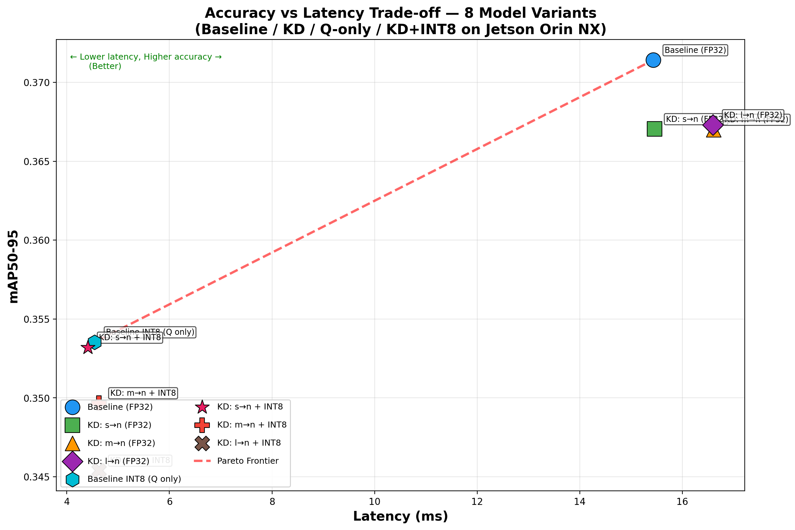

# COMP4901D — Model Compression for Deploying Vision Models on Edge Devices

Optimize YOLOv8 for edge deployment on **NVIDIA Jetson Orin NX** through a composite compression pipeline combining **Knowledge Distillation** and **INT8 Quantization**, then evaluate the accuracy-efficiency trade-off via Pareto analysis.

## Project Overview

| Stage | Technique | Description |
|-------|-----------|-------------|
| 1 | **Knowledge Distillation (KD)** | Feature-based Teacher→Student training (3 teacher variants) |
| 2 | **INT8 Post-Training Quantization** | TensorRT INT8 calibration on Jetson |
| 3 | **Benchmark** | mAP, latency, FPS, memory on Jetson (8 model variants) |
| 4 | **Pareto Analysis** | Accuracy vs Latency trade-off to select best edge model |
| 5 | **Demo** | Real-time webcam inference comparing baseline vs compressed model |

## Benchmark Results (8 Model Variants on Jetson Orin NX)

### Summary Table

| # | Model | Format | mAP50-95 | mAP50 | Latency (ms) | FPS | Memory (MB) | Size (MB) |
|---|-------|--------|----------|-------|-------------|-----|-------------|-----------|
| 1 | **Baseline** (pretrained yolov8n) | FP32 PyTorch | **0.3714** | 0.5212 | 15.44 | 64.8 | 35.6 | 6.25 |
| 2 | KD: s→n | FP32 PyTorch | 0.3670 | 0.5172 | 15.46 | 64.7 | 35.6 | 6.23 |
| 3 | KD: m→n | FP32 PyTorch | 0.3670 | 0.5165 | 16.61 | 60.2 | 35.6 | 6.23 |
| 4 | KD: l→n | FP32 PyTorch | 0.3673 | 0.5157 | 16.59 | 60.3 | 35.6 | 6.23 |
| 5 | Baseline INT8 (Q only) | INT8 TensorRT | 0.3535 | 0.4995 | 4.54 | 220.2 | 12.1 | 4.99 |
| 6 | **KD: s→n + INT8** | INT8 TensorRT | **0.3532** | **0.5044** | **4.41** | **226.9** | **12.1** | **4.97** |
| 7 | KD: m→n + INT8 | INT8 TensorRT | 0.3497 | 0.4996 | 4.63 | 216.1 | 12.1 | 4.99 |
| 8 | KD: l→n + INT8 | INT8 TensorRT | 0.3454 | 0.4978 | 4.62 | 216.3 | 12.1 | 4.99 |

### Pareto Analysis



### Key Findings

| Comparison | mAP Drop | Speedup | Memory Saving |
|------------|----------|---------|---------------|
| KD only (s→n FP32 vs Baseline FP32) | -1.2% | 1.0x | 0% |
| Quantization only (Baseline INT8 vs Baseline FP32) | -4.8% | **3.4x** | **66%** |
| **KD + Quantization (s→n INT8 vs Baseline FP32)** | **-4.9%** | **3.5x** | **66%** |

### Conclusion

1. **INT8 quantization is the primary driver of speedup** — 3.4–3.5x faster inference, 66% memory reduction, with only ~5% mAP loss.
2. **KD alone does not improve speed** (same YOLOv8n architecture), but preserves accuracy within ~1% of baseline.
3. **Combined KD + INT8 (s→n) achieves the best FPS (226.9)** among all INT8 variants, while maintaining accuracy on par with quantization-only (0.3532 vs 0.3535 mAP50-95).
4. **Smaller teachers produce better INT8 students** — YOLOv8s teacher yields the most quantization-friendly weights (s→n INT8 > m→n INT8 > l→n INT8).
5. **Best edge model: KD s→n + INT8** — highest throughput, lowest latency, competitive accuracy.

## Pipeline Details

### Step 1: Knowledge Distillation (GPU Server)

3 teacher-student distillation experiments, all distilling into YOLOv8n:

| Teacher | Student | Config | Output | mAP50-95 |
|---------|---------|--------|--------|----------|
| YOLOv8s (11.2M params) | YOLOv8n | `configs/distill_s2n_v2.yaml` | `best_s2n_v2.pt` | 0.3670 |
| YOLOv8m (25.9M params) | YOLOv8n | `configs/distill_m2n_v2.yaml` | `best_m2n_v2.pt` | 0.3670 |
| YOLOv8l (43.7M params) | YOLOv8n | `configs/distill_l2n_v2.yaml` | `best_l2n_v2.pt` | 0.3673 |

**Hyperparameters:** `alpha=0.01` (feature KD loss weight), `beta=0.0` (feature-based KD only), `epochs=100`, `imgsz=640`, student initialized from pretrained `yolov8n.pt`.

```bash
python3 train_distill.py --config configs/distill_s2n_v2.yaml
python3 train_distill.py --config configs/distill_m2n_v2.yaml
python3 train_distill.py --config configs/distill_l2n_v2.yaml
```

### Step 2: INT8 Quantization (Jetson)

Post-Training Quantization via TensorRT INT8 calibration on COCO val2017:

```bash
python3 int8_ptq.py --weights yolov8n.pt --data coco.yaml --output runs/quantize/
python3 int8_ptq.py --weights best_s2n_v2.pt --data coco.yaml --output runs/quantize/
python3 int8_ptq.py --weights best_m2n_v2.pt --data coco.yaml --output runs/quantize/
python3 int8_ptq.py --weights best_l2n_v2.pt --data coco.yaml --output runs/quantize/
```

### Step 3: Benchmark (Jetson)

```bash
python3 benchmark_jetson.py --data coco.yaml \
    --baseline-pt yolov8n.pt --distilled-pt best_s2n_v2.pt \
    --distilled-engine-int8 runs/quantize/best_s2n_v2_int8.engine \
    --output runs/benchmark_s2n_v2
```

### Step 4: Pareto Plot

```bash
python3 plot_pareto_final.py
```

## Repository Structure

```
comp4901d/
├── train_distill.py              # KD training entry point
├── eval_baseline.py              # Baseline evaluation (mAP, latency, size)
├── export_onnx.py                # Export .pt → ONNX / TensorRT FP16
├── int8_ptq.py                   # INT8 PTQ via TensorRT calibration
├── benchmark_jetson.py           # Full Jetson benchmark (8 variants)
├── plot_pareto.py                # Per-experiment Pareto plots
├── setup_jetson.py               # Jetson environment validation
├── verify_pipeline.py            # Pipeline verification
│
├── distill/                      # KD core module
│   ├── trainer.py                #   DistillationTrainer (extends Ultralytics)
│   ├── losses.py                 #   Feature MSE + Response KL-div losses
│   ├── hooks.py                  #   Feature extraction hooks
│   └── adapters.py               #   Channel alignment adapters
│
├── configs/                      # All experiment configs
│   ├── distill_s2n_v2.yaml       #   s→n KD (alpha=0.01)
│   ├── distill_m2n_v2.yaml       #   m→n KD (alpha=0.01)
│   ├── distill_l2n_v2.yaml       #   l→n KD (alpha=0.01)
│   └── ...
│
├── results/                      # All experiment outputs
│   ├── s2n_v2/, m2n_v2/, l2n_v2/ #   KD training curves & metrics
│   ├── runs/benchmark_*/         #   Jetson benchmark JSONs (8 variants)
│   ├── runs/plots_final_7pt/     #   Pareto & comparison charts
│   ├── plot_pareto_final.py      #   Final 8-point Pareto script
│   ├── run_full_pipeline.py      #   End-to-end pipeline script
│   └── README.md                 #   Jetson-side documentation
│
├── best_s2n_v2.pt                # Distilled: s→n (6.2 MB)
├── best_m2n_v2.pt                # Distilled: m→n (6.2 MB)
├── best_l2n_v2.pt                # Distilled: l→n (6.2 MB)
├── yolov8n.pt                    # Pretrained baseline (6.2 MB)
└── requirements.txt
```

## Setup

### GPU Server (KD Training)

```bash
python3 -m venv comp4901d_env
source comp4901d_env/bin/activate
pip install -r requirements.txt
```

Dataset: COCO val2017 at `datasets/coco/` (download separately, ~52GB).

### Jetson Orin NX (Benchmark & Demo)

```
Account: group1
IP: 10.89.49.44 (DHCP, may change)
```

```bash
ssh group1@10.89.49.44
cd ~/comp4901d
pip install -r requirements.txt
python3 setup_jetson.py
```

## Hardware

| Device | Specs | Purpose |
|--------|-------|---------|
| GPU Server | NVIDIA A100/V100, CUDA | KD training (100 epochs, COCO) |
| Jetson Orin NX | 8GB shared RAM, 1024 CUDA cores, TensorRT | Inference benchmark & demo |

## Real-Time Demo (Webcam)

The realtime backend is now implemented under `edge_demo/` and is designed to run on the Jetson while a UI laptop consumes frames and metrics over LAN.

### Demo Plan

| Item | Left Panel | Right Panel |
|------|-----------|-------------|
| Model | YOLOv8s (or YOLOv8n baseline) | **KD: s→n + INT8** (best compressed) |
| Format | FP32 PyTorch | INT8 TensorRT |
| Expected FPS | ~60 (n) or ~30 (s) | **~227** |
| Expected Latency | ~15ms (n) or ~30ms (s) | **~4.4ms** |

### Backend Entry Point

```bash
python -m edge_demo.main \
  --baseline-model yolov8n.pt \
  --compressed-model runs/quantize/best_s2n_v2_int8.engine \
  --host 0.0.0.0 \
  --port 8000 \
  --camera-index 0
```

### API Endpoints

- `GET /health`
- `GET /metrics`
- `GET /detections/latest`
- `GET /snapshot.jpg`
- `GET /stream/combined.mjpg`

### Key Files

| File | Description |
|------|-------------|
| `runs/quantize/best_s2n_v2_int8.engine` | Best compressed model (226.9 FPS, 4.41ms) |
| `yolov8n.pt` | Baseline for comparison (64.8 FPS, 15.44ms) |
| `yolov8s.pt` | Alternative baseline for bigger contrast (~30 FPS) |

### Expected Demo Outcome

The demo should clearly show that the compressed model (KD + INT8) runs **~3.5x faster** than the baseline while maintaining visually similar detection quality, validating the effectiveness of the compression pipeline for edge deployment.

Implementation details and Jetson launch notes are in `edge_demo/README.md`.
